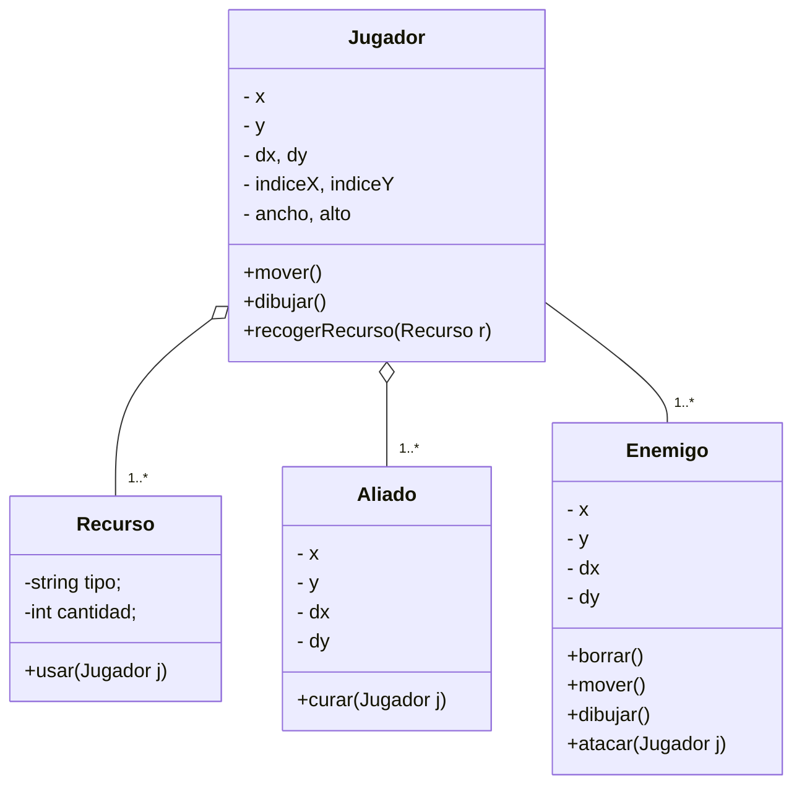

# *INFORME DEL TRABAJO FINAL*

+ Informe de Trabajo Final – Curso de Algoritmos

+ Sección: 1681

--- 

# Integrantes

| Nombre | Código |
|--------|--------|
| Calderon Mendoza Sebastian Pavel | u202412227 |
| Belon Carita Jorge Mathias | u202322422 |
| Cortez Segovia Ismael Mathias | u202412638 |

Noviembre 2025

---

# 1. Casos Reales Investigados y Conclusion

*Decisiones Tomadas Por IA:*

+ Skynet (Película Terminator): Se muestra cómo una inteligencia artificial decide eliminar a la humanidad. Muestra como una IA que toma decisiones puede volverse peligrosa.

+ GLaDOS(Videojuego Portal): Controla experimentos y toma decisiones que ponen en riesgo al jugador, priorizando la lógica de la vida.

*Decisiones Tomadas Por Humanos:*

+ Paper Please(Videojuego): El Jugador decide quien entra al país usando su criterio.

+ Naufrago(Película): El protagonista sobrevive solo gracias a sus propios errores y aprendizajes.

*Decisiones tomadas por IA + Humanos:*

+ Medicina asistida por IA: Sistema de diagnóstico ayudan a médicos a detectar enfermedades, pero la decisión final la toma el especialista humano.

+ Detroit:Became Human(Videojuego): Humanos y androides negocian su convivencia, el resultado depende de las elecciones conjuntas.

Conclusion
-

*Los casos investigados muestran que la IA sola aporta precisión pero sin empatía, inspirando enemigos y pruebas rígidas que los humanos aunque cometen errores generan aprendizaje y creatividad reflejados en personajes y recursos que la colaboración humano y IA logra el equilibrio con aliados defectuosos, recursos compartidos y un medidor de Equilibrio . El juego transmite que el verdadero progreso surge al unir tecnología y humanidad.*

# 2. Storyboard Narrativo y Visual

*1er Mundo:*
-
El protagonista llega a una ciudad tecnológica, donde todo funciona con exactitud: semáforos perfectos, robots obedientes, edificios futuristas. Sin embargo, las personas parecen huecas, vacías, caminan sin emoción. Todo está controlado por algoritmos rígidos que eliminan cada error, pero también la libertad.

Personajes
-

+ Enemigos: Guardianes del Algoritmo(las máquinas)

+ Aliados: IAS defectuosas(robots dañados, que cuestionan su programación)

+ Recursos: Chips(pueden dar experiencia o algún poder)
+ Background:

Preguntas reflexivas iniciales de cada mundo
-

“¿La eficiencia sin emociones puede llamarse vida?”

“¿Puede existir progreso sin alegría?”

---

*2do Mundo:* 
-

El protagonista llega a un pueblo humilde y sencillo, donde las personas son más expresivas, ríen, discuten, cometen errores, pero aprenden de cada error. Los recursos son limitados y las soluciones toman tiempo pero se respira creatividad y vida.

Personajes
-

+ Enemigos: Sombras(entes que representan el error humano)

+ Aliados: Anciano (hombre experimentado, que te pude dar consejos)
+ Background:

+ Recursos: Libro de conocimiento (algún poder o un consejo)

Preguntas reflexivas iniciales de cada mundo
-

“¿La verdadera humanidad se encuentra en los aciertos o en los tropiezos?”

---

3er Mundo
-

Finalmente, el protagonista llega a un mundo donde humanos y máquinas conviven en armonía. La ciudad combina humanidad con tecnología, parques verdes con drones que riegan, hospitales con médicos apoyados por la IA, aulas donde estudiantes estudian juntos a sistemas inteligentes. Aquí la vida parece equilibrada, aunque todavía hay problemas algunos desconfían de las máquinas y otros temen que los humanos sean un obstáculo.

Personajes
-

+ Enemigos: Desconfianza entre humanos y IA

+ Aliados: Humanos con herramientas tecnológicas

+ Recursos: medicinas avanzadas(otorgar salud/vida)

Preguntas reflexivas iniciales de cada mundo
-

“¿El futuro ideal es colaboración o dependencia?”

Interacciones
-

El jugador debe decidir si confía o no Dialogar puede hacer cambiar de bando

Propuesta del mensaje final crítico
-

“La perfección de las máquinas sin alma nos quitan nuestra libertad. La fragilidad humana sin apoyo nos expone a errores. Pero juntos, humanos y máquinas, podemos construir un futuro más justo y equilibrado, siempre que el juicio crítico guíe nuestras decisiones.”

---

# 3. Diagrama De Clases UML

# 4. Recursos a Utilizar En El Desarrollo Del Videojuego

Personaje
-

Recursos
-

# 5. Plan De Actividades

| Nº | Actividad                                   |Responsable| S3 | S4 | S5 | S6 | S7 | Observaciones |
|----|---------------------------------------------|-----------|----|----|----|----|----|---------------|
| 1  | Diseño del diagrama de clase                | Ismael Cortez     |    |    |    |    |    |               |
| 2  | Prototipo de la solución                    | Mathias Belon          |    |    |    |    |    |               |
| 3  | Definir interfaz del videojuego             | Sebastian Calderon          |    |    |    |    |    |               |
| 4  | Definir estructura de datos                 | Ismael Cortez          |    |    |    |    |    |               |
| 5  | Implementar herencia                        | Sebastian Calderon         |    |    |    |    |    |               |
| 6  | Clase controladora                          | Sebastian Calderon          |    |    |    |    |    |               |
| 7  | Elaborar el menú                            | Sebastian Calderon          |    |    |    |    |    |               |
| 8  | Clases complementarias                      | Mathias Belon          |    |    |    |    |    |               |
| 9  | Gestión archivos                            | Ismael Cortez          |    |    |    |    |    |               | 
| 10 | Integrar clases complementarias al proyecto | Ismael Cortez          |    |    |    |    |    |               | 
| 11 | Pruebas integrales                          | Mathias Belon          |    |    |    |    |    |               |
| 12 | Redactar el informe                         | Sebastian Pavel          |    |    |    |    |    |               |
| 13 | Preparar la exposición                      | Ismael Cortez          |    |    |    |    |    |               |
